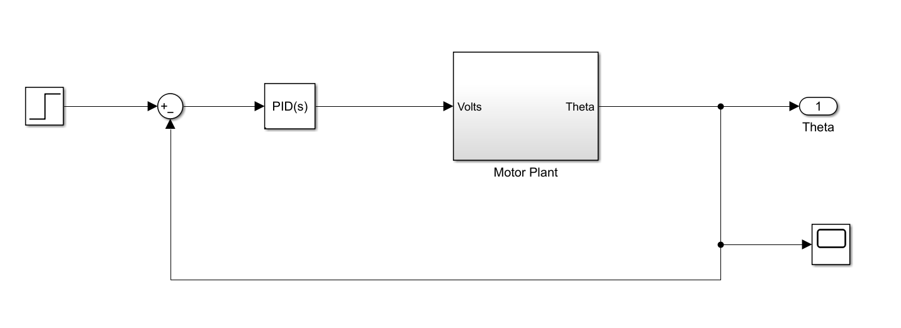
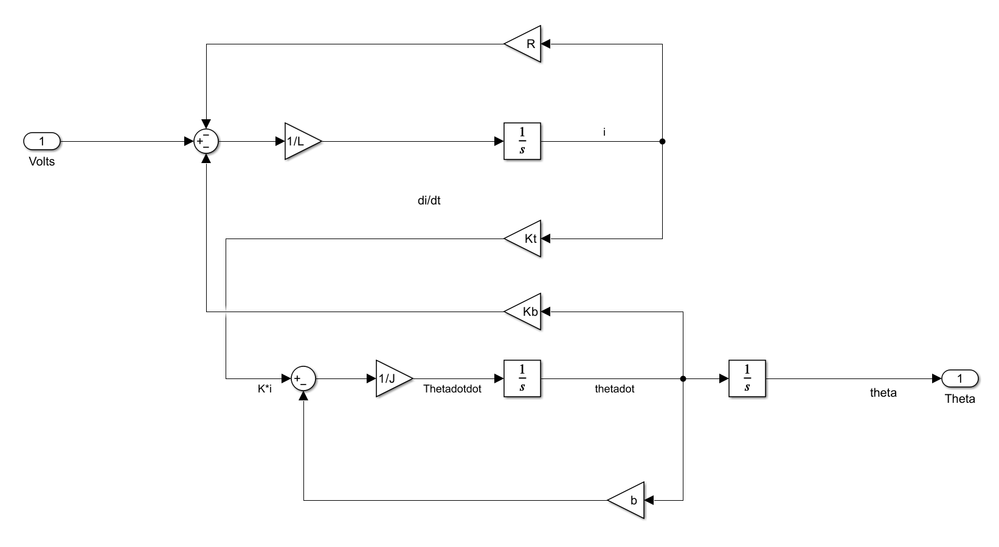
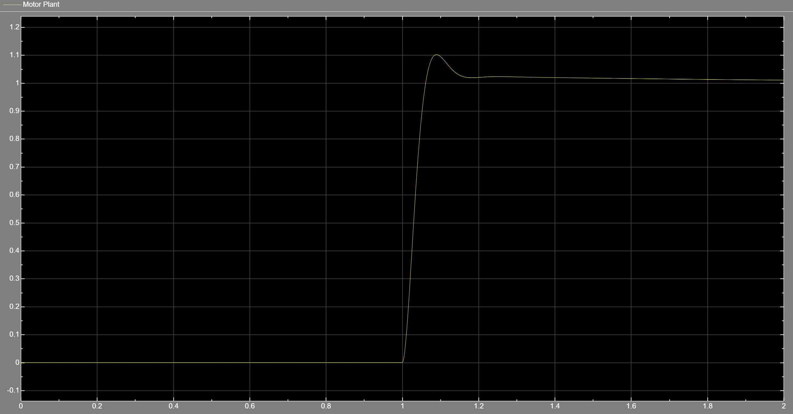

# DC Motor Speed Control with PID (Simulink)

This project focuses on the mathematical modeling and speed/position control of a DC Motor using MATLAB and Simulink. I developed a detailed model based on electromechanical differential equations and built a PID controller to achieve stable performance.

## Project Overview

- **Mathematical Modeling:** Defined electrical parameters (Resistance, Inductance) and mechanical parameters (Inertia, Damping) in a MATLAB script to initialize the simulation.
- **System Architecture:** Built a closed-loop control system in Simulink, featuring a PID block for real-time error correction.
- **Motor Modeling:** Created a model that combines the motor's electrical and mechanical parts, allowing me to track important signals like current change and motor acceleration.

## System Architecture & Results

### 1. DC Motor Model (Simulink)
The overall system includes a reference step input, a PID controller, and the motor plant model:

### 2. Motor Plant Subsystem
A detailed look inside the motor plant, showing the structure of electrical and mechanical equations:

### 3. Step Response Performance
The motor's performance in reaching the target reference speed with minimal overshoot and high stability:

## Folder Structure
- `src/:` Contains the main script (dc_motor_analysis.m) and the Simulink model (`dc_motor_model.slx`).
- `results/`: Contains the model architecture, plant subsystem details, and performance plots.

---
### Acknowledgments & Industry Context
- **Course Reference:** This project was developed as part of the **"MATLAB/SIMULINK Bible | Go From Zero to Hero + ChatGPT!
"** course by **Ryan Ahmed**.
- **Application:** Precise DC motor control is fundamental in robotics, automation, and electric vehicle steering systems.

---
Developed by Efe Erden *Control and Automation Engineering Student @ Yıldız Technical University*
